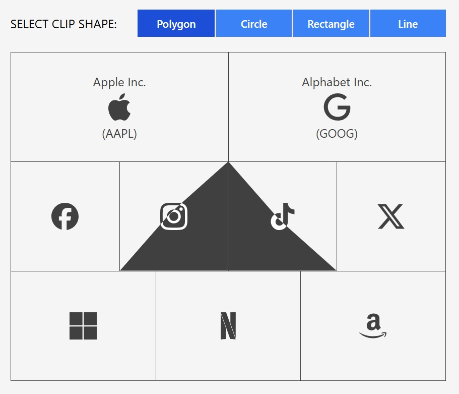

# Hover Box

This is an example of how to apply a cool cursor effect to a html styled box containing simple text. Dependencies: React, Tailwind, Framer motion.

### How to install

```console
npm install
```

### How to run

```console
npm run dev
```

### Usage

```jsx
...
import HoverBox from "../components/HoverBox";
...
<HoverBox
    clipShape='circle'
    hoverTextColor='text-white'
    hoverBackgroundColor='bg-neutral-700'
    className='h-20 w-20 flex justify-center items-center'
>
    HELLO WORLD!
</HoverBox>
```

### API Reference

| Prop                 | Type                               | Default |
| :------------------- | :--------------------------------- | :------ |
| hoverTextColor       | `string`                           | -       |
| hoverBackgroundColor | `string`                           | -       |
| clipShape            | `polygon, rectangle, circle, line` | polygon |
| duration             | `number`                           | 0.35    |
| href                 | `string`                           | -       |

### Screenshots


